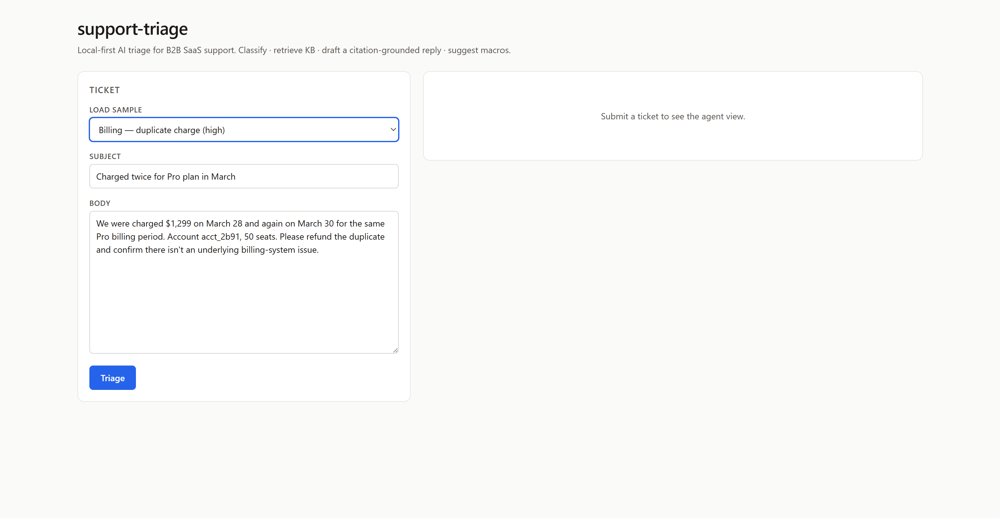
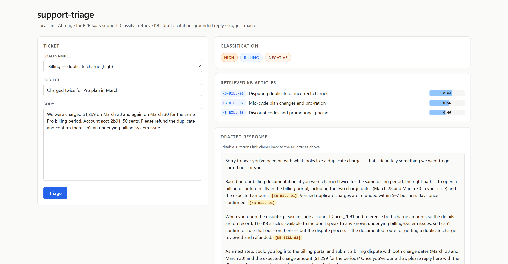

# support-triage

A local-first AI tool for B2B SaaS support teams: classify tickets, retrieve KB context via embeddings, draft citation-grounded responses, and surface the top-3 macros — with an eval harness scoring faithfulness and recall@k.

Designed for one operator on one workspace. No SaaS, no multi-tenant, no telemetry.

## Who this is for

B2B SaaS support teams who want a local-first triage assistant they can self-host and audit.

## Screenshots

Empty state — pick a sample or paste a ticket:



After triage — classification, retrieved KB, drafted reply with `[KB-…]` citations:



## Quick start

```bash
# install
uv sync && pnpm --dir frontend install

# put your Anthropic key in .env (gitignored)
echo "ANTHROPIC_API_KEY=sk-ant-..." > .env

# run dev — backend on :8000, frontend on :5173 (Vite dev-proxies API calls)
# Either of these — both spawn both processes with prefixed logs.
uv run python -m scripts.dev
make dev

# tests (no API calls)
make test

# eval drivers (one runs offline; the others hit Anthropic)
make eval-retrieval        # recall@k — local sentence-transformers, no key needed
make eval-classifier       # priority/category/sentiment accuracy
make eval-drafting         # citation-grounded reply + faithfulness
```

## What's here

- `app/` — FastAPI backend.
  - `main.py` — `POST /triage` endpoint (classify + retrieve + draft + macros).
  - `classifier.py`, `drafter.py`, `faithfulness.py` — Anthropic-powered components.
  - `retrieval.py` — sentence-transformers + FAISS for KB and macros.
  - `kb.py`, `macros.py`, `fixtures.py`, `schemas.py` — loaders and Pydantic models.
- `frontend/` — Vite + React + TypeScript triage workstation.
- `scripts/` — fixture/KB/macro generators and three eval drivers.
- `fixtures/synthetic/` — 200 labeled tickets, 26 KB articles, 19 macros.
- `tests/` — unit + integration tests (mocked LLM, real retrieval).
- `CLAUDE.md` — standing brief for Claude Code.
- `.claude/agents/worker.md`, `.claude/skills/core-workflow/SKILL.md`, `.claude/commands/run.md` — single-agent workflow setup.

## How it works

1. Load tickets from a Zendesk/Salesforce export (or the synthetic fixture set).
2. Classify each ticket: priority + category + sentiment (Anthropic tool use, prompt-cached).
3. Embed ticket text with `sentence-transformers/all-MiniLM-L6-v2` and retrieve top-k from a FAISS index over the KB.
4. Draft a citation-grounded response (Sonnet 4.6) restricted to facts in the retrieved articles or paraphrasing the customer's own report. Citations render inline as `[KB-…]`.
5. Surface the top-3 most-likely macros via the same embedding similarity over a separate macro index.

## Eval baselines

Run on the 200-ticket synthetic fixture set. All numbers reproducible from the committed fixtures + a fresh API key.

| Metric | Result | Random / modal baseline |
|---|---|---|
| Category accuracy | 95.0% | 20% |
| Priority accuracy | 62.0% | 40.5% (modal) |
| Sentiment accuracy | 63.0% | 61% (modal) |
| recall@1 | 87.5% | 3.8% |
| recall@3 | 95.8% | 11.5% |
| recall@5 | 98.9% | 19.2% |
| Faithfulness | 97.1% | n/a |

- Classifier: `claude-haiku-4-5` with prompt caching.
- Retrieval: local sentence-transformers + FAISS flat-IP. No API calls.
- Drafting: `claude-sonnet-4-6`. Faithfulness scored by `claude-haiku-4-5` — a clean-room implementation of the ragas faithfulness metric (decompose answer into atomic claims, judge each against ticket + retrieved KB).

## License

MIT.
